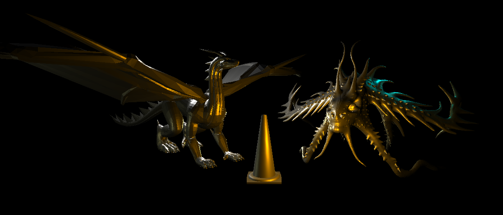

# CMPM163Labs

## Lab 2
### Part 1
Video: https://drive.google.com/file/d/15GTVrQrh1DBBSV1GhE9M-6rei60TxTuJ/view?usp=sharing

NOTE: Link is only visible to students and faculty at University of California, Santa Cruz.

The lab assignment only called for the cubes' rotations, though I added some orbiting behavior to the magenta cube to spice things up a bit.

### Part 2

Notes: I decided to experiment a little bit here. I chose a simple model to start (the cone) and two more complicated models, one of which was very low poly, and the other was high poly. The arrangement is simple: the dragon and monster are merely admiring the cone. I added some fill lights to flesh out the models, though. Particularly I chose a cyan to make the monster more aquatic seeming, a brighter white fill off to the back left, and a leftward greyish yellow green for the last bits.

Model Sources:
- Cone is attributed to Emmanuel PUYBARET / eTeks <info@eteks.com> and Scopia Visual Interfaces Systems, s.l. (http://www.scopia.es).
- Dragon is attributed to user 3dhaupt on Free3d (https://www.free3d.com/user/3dhaupt).
- Monster is attributed to user fatihayaz on Free3d (https://www.free3d.com/user/fatihayaz).

## Lab 3
Video: https://drive.google.com/file/d/1mRXQXgjN-JNhvBmhg186EWhUC1UlPFgv/view?usp=sharing

NOTE: Link is only visible to students and faculty at University of California, Santa Cruz.

### Cube Materials

**Center Cube:** The original Phong shaded cube from the assignment.

**Left Cube:** Lambert shaded cube with linear opacity modulation.

**Right Cube:** Additional Phong shaded cube with different diffuse, spec, and shininess values.

**Top Cube:** Original cube with depth-based linear interpolation.

**Bottom Cube:** Cube with modified shader code from the top cube. Specified color values are modified by a sine wave function, resulting in depth-based striations.

## Lab 4
Video: https://drive.google.com/file/d/1nlD_R_Hrbx4D9NhsaYFJJCVEN5S5U7_N/view?usp=sharing

NOTE: Link is only visible to students and faculty at University of California, Santa Cruz.

### Cube Creation

**Top & Bottom Left & Center:** ThreeJS Phong Material cubes with simple texture (left) and matching normal map (center).

**Right Top:** ThreeJS Shader Material cube with texture.

**Right Bottom:** ThreeJS Shader Material cube with tiled texture. Tiling was achieved with a modulo; I noticed that justifying the texture with a different size required a multiplication by some coefficient. By performing a modulo with the reciprocal of that coefficient, one gets the correct sizing and a complete coverage of the model via the remainder.

### Question Answers

Assuming mapping is uv(0, 0) -> xy(0, 7), or orientation correct:

a. x = 7 * u

b. y = 7 - (7 * u)

c. Grey is sampled.

Otherwise, assuming mapping is uv(0, 0) -> xy(0, 0), or coordinate correct:

a. x = 7 * u

b. y = 7 * u

c. White is sampled.

## Lab 5

Cube Explosion Video: https://drive.google.com/file/d/1OLcHz70Ze54nLrKeSPaDhM0gi4axEZ9k/view?usp=sharing

Custom Effect Video: https://drive.google.com/file/d/1Yh8PRmaHbb5_s-v9M2-6fkWD3jaHy_xT/view?usp=sharing

NOTE: Links are only visible to students and faculty at University of California, Santa Cruz.

## Lab 6

### Definitions

- Point Light: A light source that casts light equally in all directions from its origin.

- Spotlight: A light source that casts light in a specified cone from its origin.

- Directional Light: A light source that casts light globally in a single direction.

- Area Light: A light source that casts light from one side of a plane, in all directions.  

### Material Replication

Reference Image: 

Reproduction: 

Process: To go about creating some basic materials for my Nintendo Switch, I took three reference points: the left, red Joycon; the right, blue Joycon; and the center, black screen. I started with the screen, and determined that a smooth, highly specular, and very reflective material would work great. I applied these properties and found quick, positive results. For the Joycons, I noticed that their material was vibrant, but somewhat diffuse. I decided to apply a non-metallic approach to these, with low smoothness, and changed the Albedo color to represent their color differences.

### Textures

Pebbles and Sapphire texture maps were made by Joao Paulo. (https://3dtextures.me/2020/05/08/pebbles-020/, https://3dtextures.me/2018/10/04/sapphire-001/). 

I merely applied these textures to spheres, respectively, using their Albedo, Normal, Ambient Occlusion, and Height maps for a metallic-approach Standard Shader-based material.

### Skybox

I created a custom, procedural skybox with a large Sun, as well as cooler blue and lavender colors to evoke the sense of some distant planet, and to play well with the magenta of the area light. I think it ties the whole scene together in a nice way.

### Scene

Setup: 

Final: 
